**Mapping the French Novel**

**Lessons and Results from the Digitization of the Print Bibliography of 18th-century French Novels**

#### Katie McDonough
#### Western Sydney University
#### @khetiwe24

###### http://fbtee.uws.edu.au/mpce/

**MMF1**		1970s	
Angus Martin, Vivienne Mylne, and Richard Frautschi, eds. *Bibliographie du genre romanesque francais, 1751-1800* (London, 1977)

**MMF2**		1980s-2010s 
AM, VM, RF continue revising original entries, adding pre-1700 entries and 1700-1750 entries in computer database

**MMF3**		2016-18	
AM collaborates with Mapping Print, Charting Enlightenment project

1. What research questions drove database development?
2. What interpretative interventions were made?
3. What is new about the MMF3 phase?

#### What research questions drove database development?

###### Martin/Frautschi 2002: 

- What is the level of production of first editions and re-editions?
- Who are the most prolific authors of the 18th c?
- What were the most reprinted fiction works?
- What words appear most frequently in titles?
- What can we learn about stated publication places and publishers?

#### AM @ SHARP 2016:

- Would a large number of present-day library locations reveal not only large print runs but also something about the reception of works in different geographical areas?
- Is there a correlation between a large number of re-editions and a large number of surviving copies? 

#### What interpretative interventions were made?

###### Defining the fields for data capture
45 data fields in Notebook software
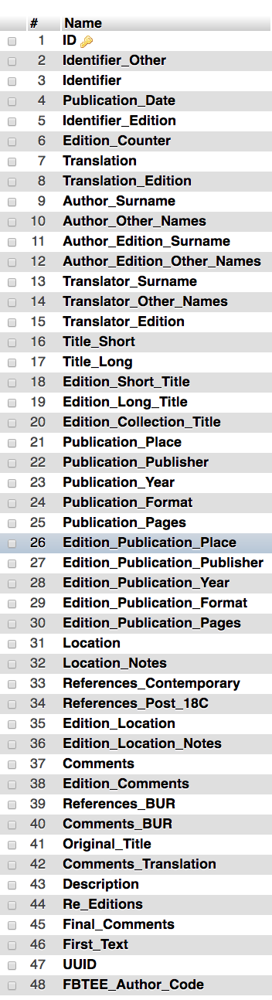

###### Developing a method for differentiating between works and editions (first editions/subsequent editions)
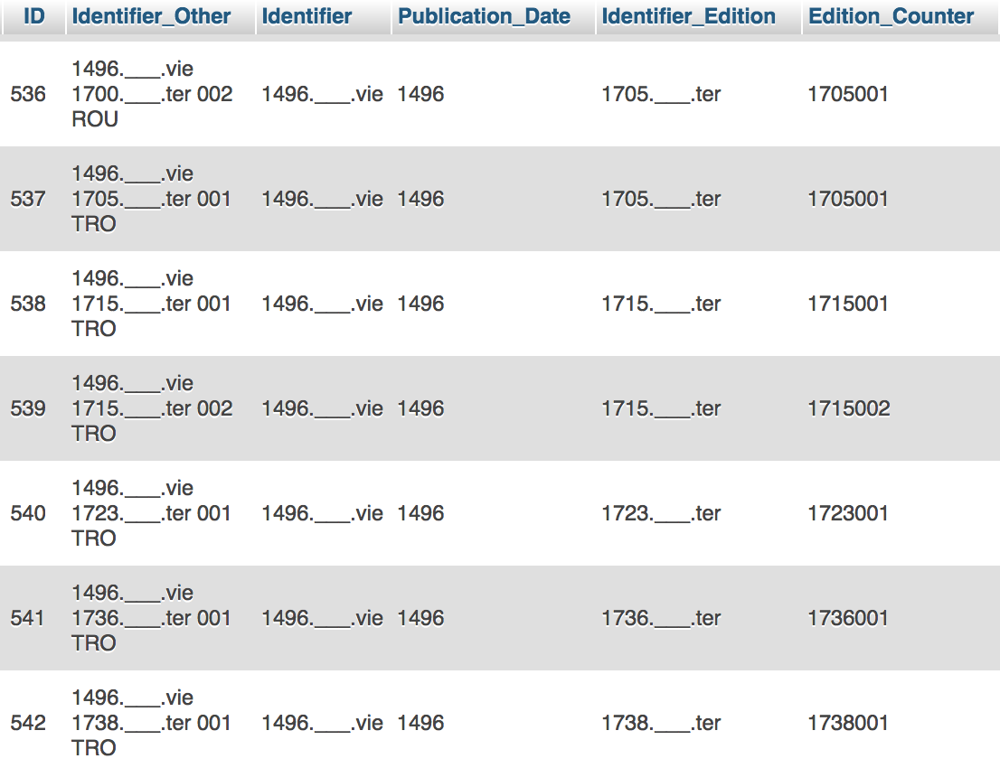

###### Connecting edition data with current holdings
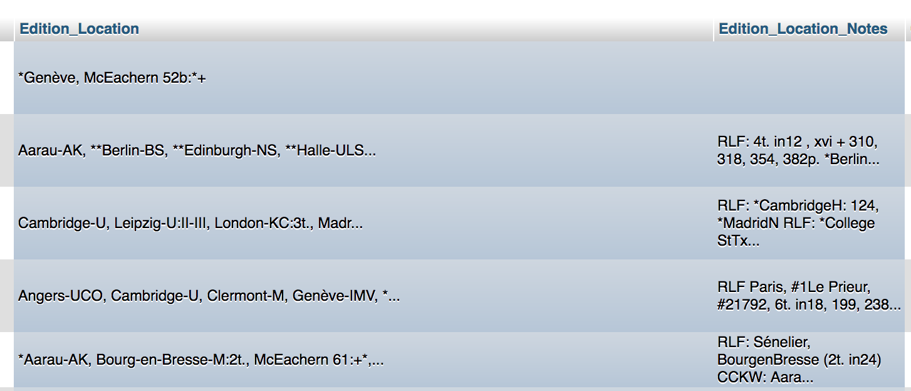

#### What is new about the MMF3 phase?	
Focus on data relationships, shift to relational database
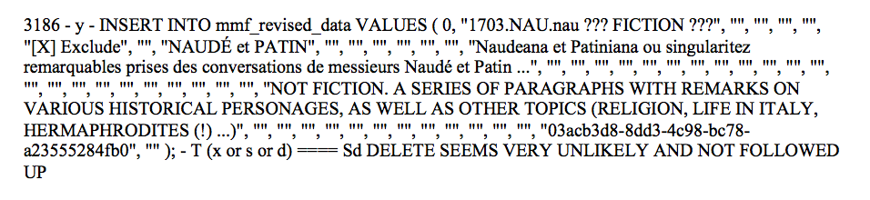

###### Connecting metadata
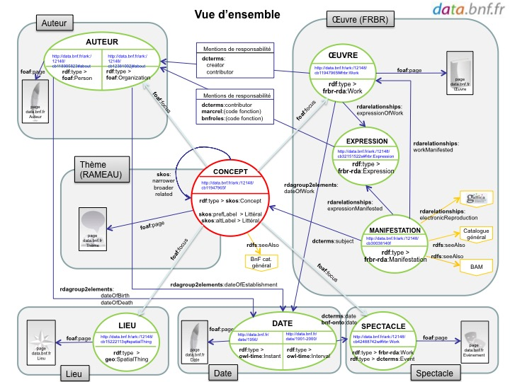

FRBR
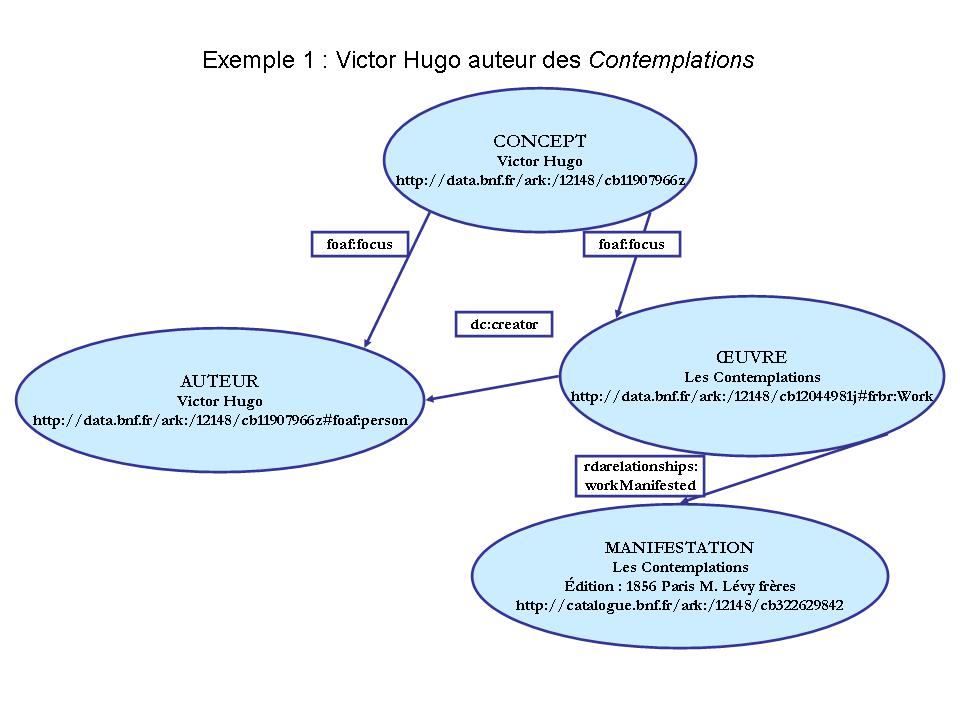

###### Thinking geographically

False/fictitious publication places 

Henry Cotton, **A Typographical Gazetteer** (Oxford, 1831)
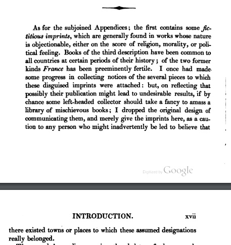

--> A Sodome et a Cythere. Et se trouvent plus qu'ailleurs dans la poche de ceux qui le condamnent.

Locating places

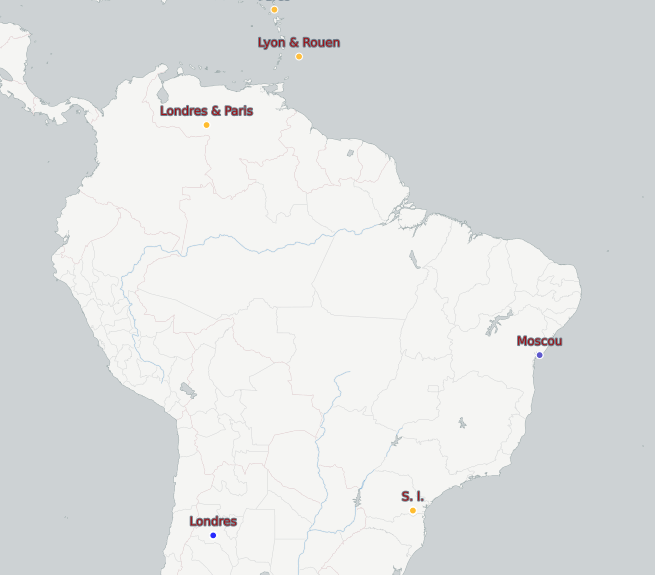

###### Providing & consuming data

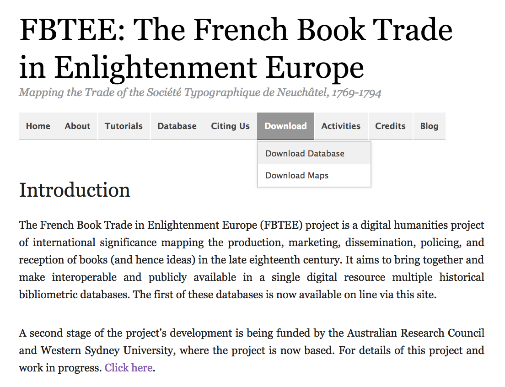

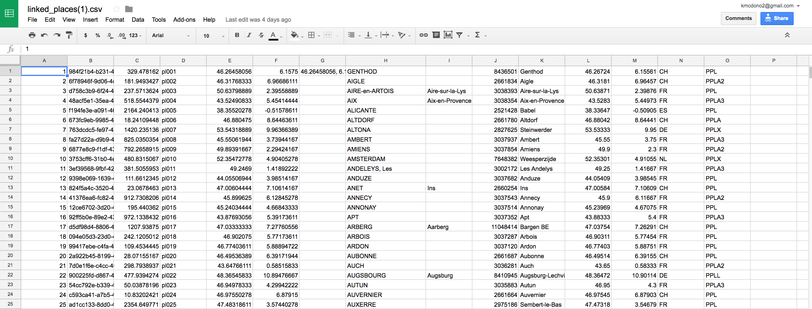

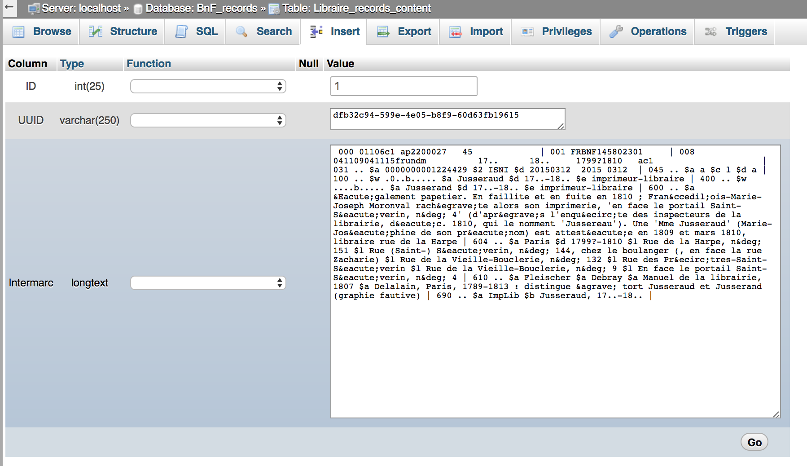

#### Lessons for now

Databases are an **intermediary** between sources and researchers - what & who these are changes over time (intentional design for future users)

Inter-generational research projects highlight the effects of **datafication** of the archival sources (layers of interpretation, coding)

#### Results To Come!

Transforming 21553 records of works and editions

Locating 2830 repositories and ~ 600 publication places

Linking to existing FBTEE database + others

Hoping for a WorldCat API connection
