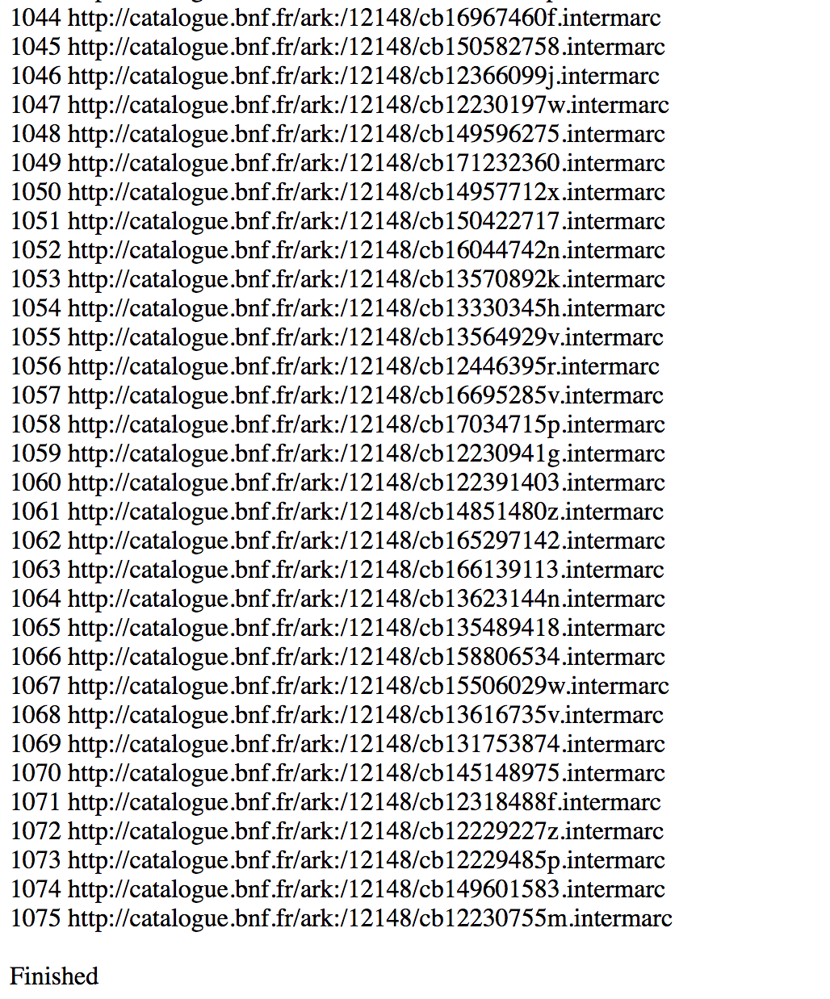

#### SHARP2017

#### **Mapping the French Novel**
##### **Lessons and Results from the Digitization of the Print Bibliography of 18th-century French Novels**
---
###### Katie McDonough
###### Western Sydney University
###### @khetiwe24

###### http://fbtee.uws.edu.au/mpce/

#### MMF1		1970s	
###### Angus Martin, Vivienne Mylne, and Richard Frautschi, eds. *Bibliographie du genre romanesque francais, 1751-1800* (London, 1977)
---
#### MMF2		1980s-2010s 
###### AM, VM, RF continue revising original entries, adding pre-1700 entries and 1700-1750 entries in computer database
---
#### MMF3		2016-18	
###### AM collaborates with Mapping Print, Charting Enlightenment project

#### 1. What research questions drove database development?
#### 2. What interpretative interventions were made?
#### 3. What is new about the MMF3 phase?

##### 1. What research questions drove database development?

###### Martin/Frautschi 2002: 
###### What is the level of production of first editions and re-editions?
###### Who are the most prolific authors of the 18th c?
###### What were the most reprinted fiction works?
###### What words appear most frequently in titles?
###### What can we learn about stated publication places and publishers?

#### AM @ SHARP 2016:
###### Would a large number of present-day library locations reveal not only large print runs but also something about the reception of works in different geographical areas?

###### Is there a correlation between a large number of re-editions and a large number of surviving copies? 

###### How does one interpret 'collaborative' editions, where the same printing is issued under a number of different title pages bearing the names of different publishers? What does it mean when there are a large number of library copies for some editions and not for others?

###### Do pirate editions achieve lower or higher numbers of copies? 

###### To what extent does the current geographical representation of copies coincide with their original distribution in the eighteenth century?

#### RF and AM @ ISECS 2015: Micro & Macro questions
##### **Micro** = 

###### researchers seek more detailed descriptions of individual first and re-editions for patterns of actual production locations, print materials, and font styles

---

##### **Macro** = 
###### patterns of content, narrative form and location as these evolved over time and space 

##### 2. What interpretative interventions were made?

###### Defining the fields for data capture

###### Adopting database model for MMF2 (Notebook software)

###### Developing a method for differentiating between works and editions (first editions/subsequent editions)

###### Choosing at first to limit the bibliography to 1750-1800, then expanding the digitized database to the entire century

###### Choosing to travel to specific libraries where edition examples could be located, later using WorldCat/CCF/COPAC/KVK/emails to librarians to verify holdings

##### 3. What is new about the MMF3 phase?

	
##### Our questions
###### From historical semantics to political, social, and economic history

##### Our interpretative interventions
###### Focus on data relationships, shift to relational database

###### Connecting metadata

###### Thinking geographically

###### Accessibility (data dump, API, linked data)

##### Lessons
###### Bibliographic metadata is a pathway from books to people & places (focus on booksellers, publication and reading geographies)

##### Results
###### 21553 records of works and editions
###### 

